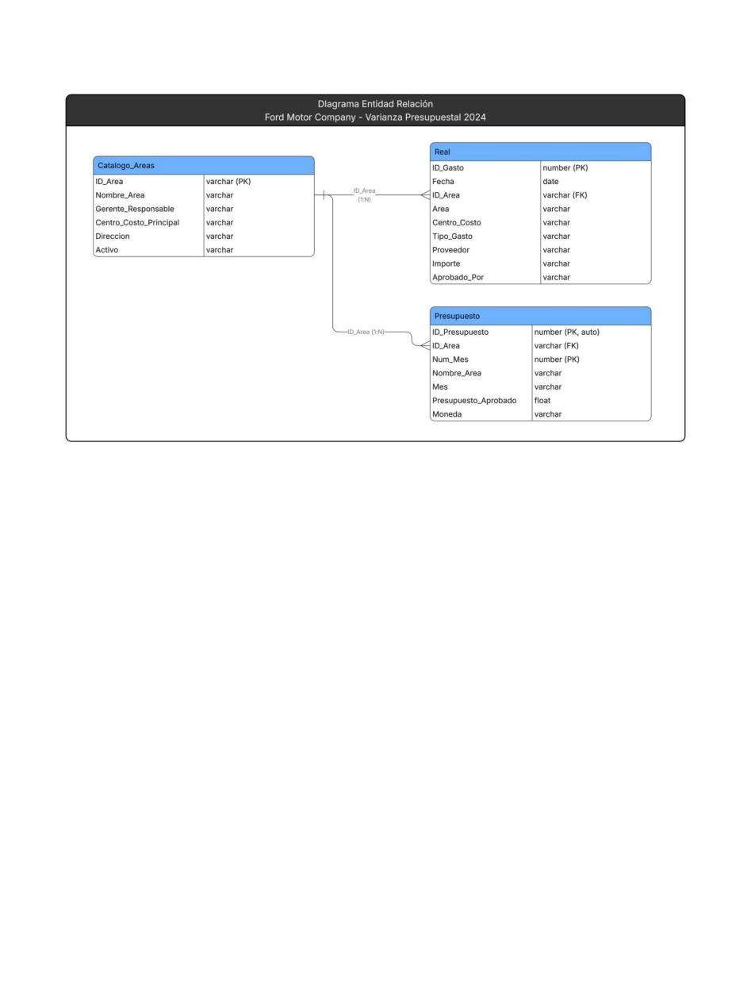
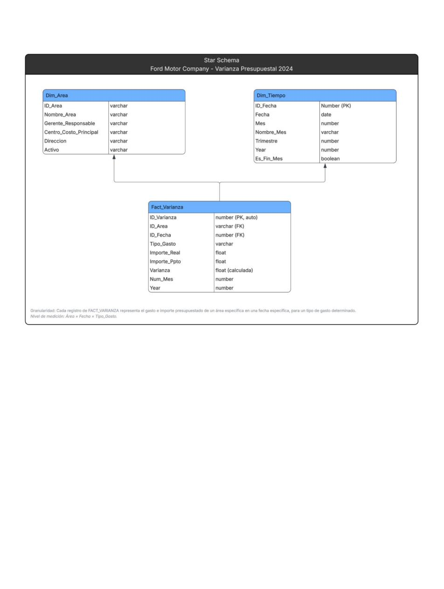

# Ford Motor Company — Budget Variance Analysis on Snowflake

> End-to-end data engineering and analytics project built on Snowflake — from raw financial data to an interactive dashboard. Developed as a team project for the *Integración de Bases de Datos con Snowflake* course at Tecnológico de Monterrey (Educación Continua).

---

## The Business Problem

Imagine you're a data analyst at Ford Motor Company. Finance gives you a spreadsheet with over 500 spending transactions across 8 business areas throughout 2024. They also give you the approved budget for each area, month by month. The question is simple: **did each area spend more or less than what was planned?**

The answer, however, was not. The raw data had mixed date formats, amounts stored as text with `$` signs and commas, missing cost centers, and no direct way to link actual spending to the budget. This project solves that — step by step — entirely in Snowflake.

---

## How the Project Was Built

The project follows a logical progression: first understand the data structure, then model it, load it, audit it, clean it, query it, and finally expose it as a live dashboard. Each phase builds on the previous one.

### Phase 1 — Data Modeling (Before Writing a Single Line of SQL)

Before touching any data, the first step was understanding how the three tables related to each other and designing the right structure to support analysis.

**Entity-Relationship Diagram** — maps the operational relationships between the three source tables.

<p align="center">
  
</p>

> `CATALOGO_AREAS` is the master table. Both `REAL` (actual spending) and `PRESUPUESTO` (approved budget) link to it through `ID_Area`. This N:1 relationship is what makes the variance comparison possible.

**Star Schema** — transforms the operational model into an analytics-ready dimensional model.

<p align="center">
  
</p>

> The star schema separates facts (spending and budget amounts) from dimensions (area and time). This is the foundation for efficient aggregation and filtering in analytics queries. Granularity: one record per area × date × expense type.

---

### Phase 2 — Loading Data into Snowflake

With the model defined, the three tables were created in `FORD_DB.FINANZAS` and loaded from CSV files using Snowflake's internal stage.

A few intentional decisions made here:

- **`Fecha` stored as `VARCHAR`** — the source data had three mixed date formats (`YYYY-MM-DD`, `DD/MM/YYYY`, `DD/Mon/YYYY`). Forcing a `DATE` type at load time would have silently dropped rows. The conversion was handled properly in the cleaning phase.
- **`Importe` stored as `VARCHAR`** — amounts came formatted as `$1,234.56`. Same reasoning: load first, clean deliberately.
- **Composite natural key on `PRESUPUESTO`** — instead of an autoincrement ID, the table uses `(ID_Area, Num_Mes)` as the primary key. Since the data has exactly one budget record per area per month (8 areas × 12 months = 96 rows), this combination is semantically unique and enables direct joins without a surrogate key.

📄 See [`sql/03_ddl_load.sql`](sql/03_ddl_load.sql)

---

### Phase 3 — Data Profiling (Auditing Before Cleaning)

Before making any changes, the data was thoroughly audited to understand what needed to be fixed and why.

Key findings documented in the profiling report:

| Issue | Column | Impact |
|---|---|---|
| 57 null values | `Centro_Costo` | 11.3% of rows unclassifiable by cost center |
| 37 null values | `Tipo_Gasto` | 7.3% of rows with no expense category |
| 117 null / "Pending" values | `Aprobado_Por` | 23.2% of rows with no approval trace |
| 53 rows with unparseable dates | `Fecha` | Three mixed formats, one causing parse failures |
| Amounts stored as text | `Importe` | `$` and commas blocking all numeric operations |
| Duplicate `ID_Gasto` values | `ID_Gasto` | Primary key not actually unique |

> Total annual budget across all 8 areas: **$143,208,703.64 MXN**

📄 Full profiling report: [`docs/04DataProfilingReport.pdf`](docs/04DataProfilingReport.pdf)

📄 See [`sql/04_profiling.sql`](sql/04_profiling.sql)

---

### Phase 4 — Data Cleaning

Each issue found in profiling was resolved with a targeted SQL fix:

- Null `Centro_Costo` → filled with `'9999-Desconocido'`
- Three date formats → parsed with layered `COALESCE(TRY_TO_DATE(...))` calls into a new `FECHA_CLEAN DATE` column
- `Importe` as text → cleaned with `REPLACE()` and converted to `NUMBER(15,2)` in a new `IMPORTE_CLEAN` column
- Null `Tipo_Gasto` → filled with `'Sin Clasificar'`
- Null / `'Pending'` approvers → standardized to `'Pendiente de Aprobación'`
- Duplicate `ID_Gasto` → table rebuilt with `ROW_NUMBER()` generating a true unique key (`ID_GASTO_UNICO`), preserving the original value in `ID_GASTO_ORIGINAL`

After cleaning, profiling queries were re-run to confirm zero nulls remaining in critical columns and zero unparseable dates.

📄 See [`sql/05_cleaning.sql`](sql/05_cleaning.sql)

---

### Phase 5 — Multi-Table Queries (The Actual Analysis)

With clean data, the three tables were joined to calculate budget variance by area and quarter.

The join logic uses `ID_Area + Num_Mes` (not a trimester column — which doesn't exist in the source data) to match actual spending to the approved budget. Quarter grouping is derived on the fly: `QUARTER(FECHA_CLEAN)` on the spending side and `CEIL(Num_Mes / 3.0)` on the budget side.

Key queries:

- **Master query** — variance by area and quarter with percentage deviation
- **Q1** — Top 5 area-quarter combinations where spending exceeded budget the most
- **Q2** — Which quarters had total spending above the approved budget company-wide
- **Q3** — LEFT JOIN to detect any area in the catalog with zero spending records

📄 See [`sql/06_joins.sql`](sql/06_joins.sql)

---

### Phase 6 — View + Streamlit Dashboard

The master query was encapsulated into a reusable Snowflake view (`VW_VARIANZA_FORD`), then consumed by a Python Streamlit app deployed directly in Snowsight.

The app lets users filter by quarter and see the variance table and bar chart update in real time — all running inside Snowflake without any external infrastructure.

```python
df_full = session.sql("SELECT * FROM FORD_DB.FINANZAS.VW_VARIANZA_FORD").to_pandas()
trimestre_sel = st.selectbox("Selecciona un trimestre:", trimestres)
df = df_full[df_full["TRIMESTRE"] == trimestre_sel]
st.dataframe(df)
st.bar_chart(df, x="NOMBRE_AREA", y="VARIANZA")
```

📄 See [`sql/07_view.sql`](sql/07_view.sql) and [`streamlit/streamlit_app.py`](streamlit/streamlit_app.py)

---

## Dashboard Preview


> Live app deployed on Streamlit in Snowsight. Requires Snowflake account access — the view and app run inside `FORD_DB.FINANZAS`.

---

## Repository Structure

```
snowflake-budget-variance-ford/
│
├── README.md
│
├── sql/
│   ├── 03_ddl_load.sql        # Database setup, table creation, and CSV load
│   ├── 04_profiling.sql       # Data audit queries
│   ├── 05_cleaning.sql        # Data cleaning scripts
│   ├── 06_joins.sql           # Multi-table JOIN queries and variance analysis
│   └── 07_view.sql            # Snowflake view definition
│
├── streamlit/
│   └── streamlit_app.py       # Python app deployed in Snowsight
│
├── docs/
│   ├── 01DiagramaER.pdf       # Entity-Relationship diagram
│   ├── 02StarSchema.pdf       # Star Schema / dimensional model
│   └── 04DataProfilingReport.pdf  # Full data profiling report
│
└── screenshots/
    └── streamlit_dashboard.jpeg   # App running in Snowsight
```

---

## Tech Stack

| Layer | Tool |
|---|---|
| Cloud Data Platform | Snowflake (Snowsight) |
| Data Modeling | Entity-Relationship + Star Schema |
| Data Ingestion | Internal Stage + COPY INTO |
| Data Transformation | SQL (DDL, DML, CTEs, Window Functions) |
| Dashboard | Streamlit in Snowflake (Python) |
| Source Data | Excel → CSV (Ford Motor Company simulated dataset) |

---

## About

Developed by **Ana Gabriela Urbina** as part of a team project for the *Integración de Bases de Datos con Snowflake* course — Educación Continua, Tecnológico de Monterrey.
